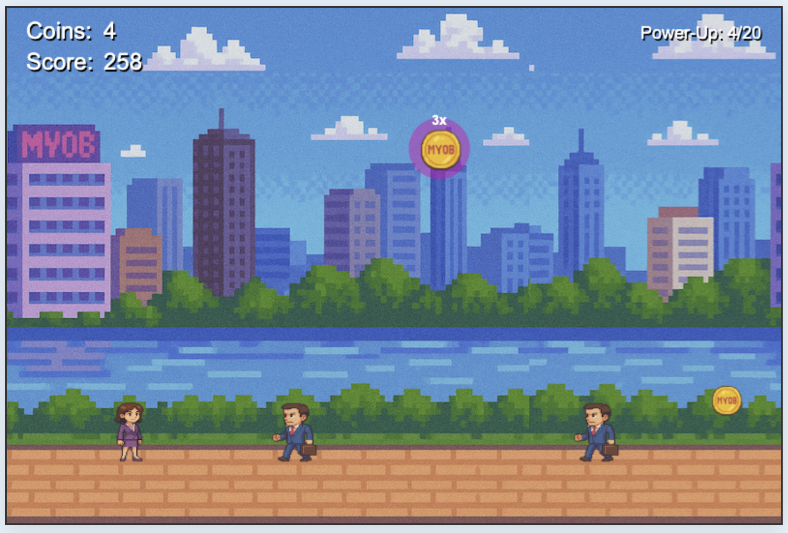

# MYOB Retro Runner

An HTML5 Canvas-based endless runner game featuring the MYOB brand colours and theme.

[Click here to try it out!]https://sarahgsmalley.github.io/myob-retro-minigame/



## Game Description

MYOB Retro Runner is a browser-based endless runner game where players control a character that must jump over enemies (the Tax Man) while collecting coins for points. The game features increasing difficulty, power-ups, and special visual effects.

The game was developed with the help of AI using the Cursor IDE in order to test how the AI could assist in rapid prototyping. All images were also generated using AI.

## Game Mechanics

### Core Gameplay

- **Controls**: Press Space or Up Arrow to jump. Press again while in the air for a double-jump.
- **Character Movement**: The character remains in a fixed horizontal position while the background and obstacles scroll toward the player.
- **Scoring**: Points are earned in two ways:
  - Time-based: 10 points per second of play
  - Coins: 50 points per regular coin, 150 points per high-value coin
- **Game Over**: Occurs when the player collides with an enemy.

### Unique Features

- **Progressive Difficulty**: Speed increases gradually over time and accelerates at score milestones (1000, 2000, 5000, 10000 points).
- **Double Jump**: Allows reaching high-value coins that appear at greater heights.
- **Power-Up System**: Collecting 20 coins activates a power-up mode that:
  - Makes the player invincible for 10 seconds
  - Applies a speed boost
  - Adds rainbow visual effects and particles
  - Spawns a sequence of coins and enemies to navigate through
- **Recovery Period**: After a power-up ends, the game provides a 2-second safety period with no enemies nearby.
- **Visual Effects**:
  - Particle effects for double jumps
  - Rainbow glow and sparkles during power-up mode
  - High-value coins have a pulsing glow effect
  - Text shadows throughout the game

## Technical Implementation

### Development Timeline

The game was built in around 3 hours using the Cursor AI IDE.

#### Time Breakdown

**Within 10 minutes:**
- Working prototype with placeholder shapes

**First hour:**
- Replaced placeholder shapes with AI-generated images (using DALL·E 3)
- Troubleshooted background display issues
- Fixed gameplay bugs (speed reset issues when restarting)
- Improved collision detection for better gameplay feel

**Hours 1-2:**
- Added double-jump mechanics and high-value coins
- Implemented power-up system with invincibility and special effects
- Created progressive difficulty scaling
- Added visual effects (particles, glows, text shadows)

**Hours 2-3+:**
- Polished visuals and fixed remaining issues
- Moved UI elements (like the power-up counter)
- Adjusted enemy spawning for better difficulty progression
- Added recovery period after power-ups
- Refactored code and added appropriate comments
- Made text color adjustments and animations

### AI Prompt Examples

The following text was provided to the AI as the initial prompt to build a basic prototype of the game. The AI model asked if I would prefer a single HTML file or separate files for JS and CSS, to which I replied separate files. I also clarified that all objects could be represented with basic shapes to be replaced with images later.

```
Design an endless runner style game with straightforward, addictive mechanics:

Continuous Scrolling: The game world auto-scrolls from right to left, giving the illusion of the player moving to the right. There is no backward movement – just continuous forward progress.
Player Character: A simple avatar (could be a pixelated business person, a MYOB mascot, or even just a square sprite) that the player controls. The character is always running forward automatically due to the scrolling world. Be creative it can be anything. 
Controls: The player uses the keyboard to jump or perform actions, and possibly the mouse for certain interactions:
Keyboard: e.g., Spacebar or Up Arrow to jump (or fly, if you implement a Flappy Bird style). Jumping lets the player dodge obstacles and collect floating coins.
Mouse (optional): Could be used for clicking on buttons (like a restart button on game over) or additional mechanics if desired.
Goals: Collect coins and avoid enemies:
Coins appear in the path; running into a coin increments the coin count (score).
Enemies themed as the boss characters will appear as obstacles. If the player collides with an enemy or hazard, it's game over. Consider what the enemies are - maybe. 
Difficulty Progression: As time passes or as score increases, the game should gradually become faster and harder:
Speed Increase: The scrolling speed increases, making obstacles approach more quickly.
More Obstacles: Enemies ("Tax Man" and potentially other boss characters) could appear more frequently or in trickier configurations.
Higher Jump Challenge: If implementing jumping, you might increase gravity or obstacle height slightly over time.

Some additional requirements:
- Must run smoothly in any modern desktop browser
- Use an HTML5 Canvas for rendering the game graphics. Direct Canvas API usage (with JavaScript) is recommended for simplicity . This is a 2D game, so WebGL is not necessary.
- Minimal dependencies
- Avoid heavy frameworks or large libraries – we want the game to load fast and run smoothly even on modest hardware. A single HTML file with Canvas and JS, or a small set of files, should suffice.
- Ensure the game loop (animation frame updates) is efficient. Use requestAnimationFrame for the game loop to optimize rendering. With simple graphics, a steady 60 FPS should be achievable in-browser.
- Implement a continuously scrolling background to create the illusion of movement.
- No sound
- The game should be runnable by simply opening an HTML file (plus any assets) in a browser. No server-side code is needed. Ensure all assets are referenced relatively so that the game could even run locally or be dropped into a simple web server.
```

Later prompts were brief requests for updates to visuals or game mechanics:

```
Can we now add a double-jump feature? So if the player presses space while the player is in the air, the character can jump once more.
```

```
Perfect! Now let's add a score counter, separate from the coins count. it generates at a constant rate but also increases as I collect coins.
```

```
I now want to add a power-up. After collecting 20 coins, the player activates a special "MYOB Business Power-Up". The power up should visually transform the player- add a flashy effect with rainbow colours. This should give the player invincibility and a speed boost for 10 seconds. After the 10 seconds, the power-up ends, and the speed should go back to how it was, and the player can go back to collecting another 20 coins to unlock the power-up again.
```

```
Can you create a gap of no enemies after the power-up timer ends, so there is a chance to recover and not immediately get hit
```

```
Can you make the text on the title screen bounce up and down slowly
```

### Architecture

The game is built using vanilla JavaScript with the HTML5 Canvas API, requiring no external libraries or frameworks. This ensures fast performance and broad browser compatibility.

Key components include:

- **Canvas Rendering**: All game elements are drawn on a single HTML5 canvas
- **Game Loop**: Utilizes requestAnimationFrame for smooth animation
- **Collision Detection**: Uses rectangle-based hitboxes with adjustable margins
- **Particle System**: Manages sparkles and visual effects
- **Dynamic Difficulty**: Scales enemy spacing and speed based on player progress

### Files

- **index.html**: Basic HTML structure with canvas element
- **style.css**: Minimal CSS styling for the game container
- **game.js**: All game logic, rendering, and mechanics
- **assets/**: Folder containing game images and sprites

## Running the Game

1. Clone or download this repository
2. Open `index.html` in a modern web browser
3. Click the game canvas or press Space/Up Arrow to start
4. Jump over enemies and collect coins!

## Browser Compatibility

The game works best in modern browsers that support HTML5 Canvas:
- Chrome
- Firefox
- Safari
- Edge